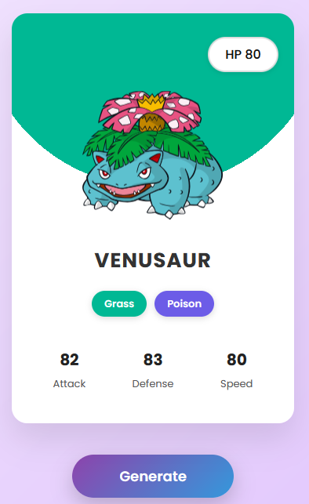
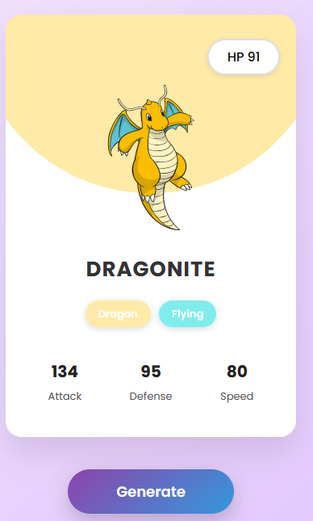
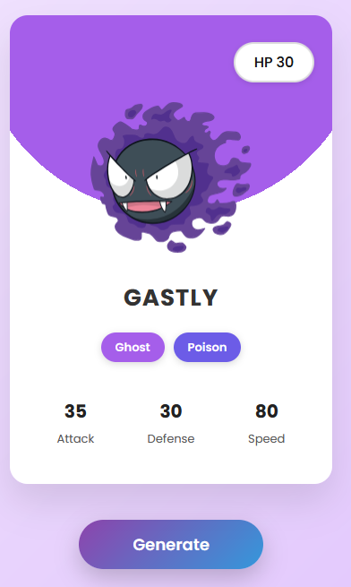

# 🔮 Pokémon Card Generator

> Catch 'em all — one card at a time! 🎴✨

Welcome to the **Pokémon Card Generator**, a mini web app that fetches a random Pokémon and transforms it into a dynamic trading card with vivid type colors, crisp stats, and cool animations — all powered by the amazing [PokeAPI](https://pokeapi.co/)! Perfect for fans who want a quick nostalgia hit or developers learning API & DOM magic 🪄.

---

## 🎮 Live Demo

👉 [**Try It Now!**](https://mai12122.github.io/pokemon)  
Refresh for a new Pokémon or click the button — every click’s a surprise!

---

## 📸 Screenshot

> Here's what you'll see when the magic happens 🪄

---

## 🔧 How It Works

1. Click the **"Generate Pokémon"** button.
2. The app fetches data for a random Pokémon from the [PokeAPI](https://pokeapi.co/).
3. It dynamically styles the card based on the Pokémon's **type** (fire, water, psychic, etc.).
4. Stats, name, HP, and artwork are beautifully rendered onto the card.

##image

